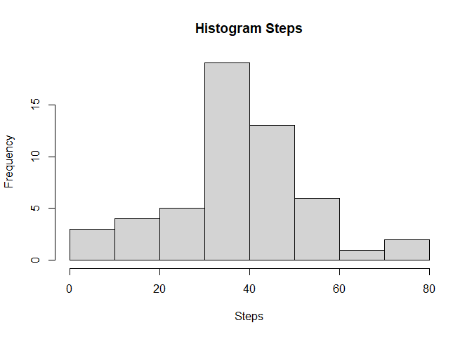

## Loading and preprocessing the data


```r
library(readr)
```

```
## Warning: package 'readr' was built under R version 4.1.3
```

```r
library(readxl)
library(dplyr)
```

```
## 
## Attaching package: 'dplyr'
```

```
## The following objects are masked from 'package:stats':
## 
##     filter, lag
```

```
## The following objects are masked from 'package:base':
## 
##     intersect, setdiff, setequal, union
```

```r
Activity <- read_csv("activity.csv")
```

```
## Rows: 17568 Columns: 3
```

```
## -- Column specification --------------------------------------------------------
## Delimiter: ","
## dbl  (2): steps, interval
## date (1): date
## 
## i Use `spec()` to retrieve the full column specification for this data.
## i Specify the column types or set `show_col_types = FALSE` to quiet this message.
```

```r
DFActivity <- Activity[complete.cases(Activity), ]
```

## What is mean total number of steps taken per day?

```r
meanSteps <-Activity %>%
  group_by(date) %>%
  summarise(n = mean(steps))

mean(meanSteps$n)
```

```
## [1] NA
```

```r
median(meanSteps$n)
```

```
## [1] NA
```

```r
hist(meanSteps$n,
     xlab = "Steps",
     main = "Histogram Steps",
     breaks = sqrt(nrow(meanSteps))
     )
```

<!-- -->


## What is the average daily activity pattern?

```r
averagedailypatterns <- DFActivity %>%
          group_by(interval) %>%
          summarise(n = mean(steps))

plot(averagedailypatterns$interval,averagedailypatterns$n,type = "l",
              ylab = "steps",
              main = "Average Steps per 5 minute interval",)
```

<!-- -->

```r
maxinterval <- averagedailypatterns[which.max(averagedailypatterns$n),]
```


## Imputing missing values


```r
Activity$NAs <- apply(is.na(Activity),1,sum)
nrow(Activity)
```

```
## [1] 17568
```

```r
sum(Activity$NAs)
```

```
## [1] 2304
```

```r
library(tidyr)
```

```
## Warning: package 'tidyr' was built under R version 4.1.3
```

```r
  DFActivityfill <- Activity %>%
     mutate(steps= replace_na(steps,mean(steps,na.rm=TRUE)))

  
mean(DFActivityfill$steps)  
```

```
## [1] 37.3826
```

```r
median(DFActivityfill$steps)
```

```
## [1] 0
```

## Are there differences in activity patterns between weekdays and weekends?


```r
DFActivityfill$weekdays <- weekdays(DFActivityfill$date)
DFActivityfill$type<- as.factor(ifelse(DFActivityfill$weekdays == "Sunday"| DFActivityfill$weekdays == "Saturday","Weekend","Weekday"))

DayType <-DFActivityfill %>%
  group_by(interval,type) %>%
  summarise(n = mean(steps))
```

```
## `summarise()` has grouped output by 'interval'. You can override using the
## `.groups` argument.
```

```r
DayType1 <- subset(DayType,type=="Weekday")
DayType2 <- subset(DayType,type=="Weekend")

par(mfrow=c(2,1))
plot(DayType1$interval,DayType1$n,type = "l",
              ylab = "steps",
              main = "Average Steps per 5 minute Weekday")
plot(DayType2$interval,DayType2$n,type = "l",
              ylab = "steps",
              main = "Average Steps per 5 minute Weekend")
```

<!-- -->
